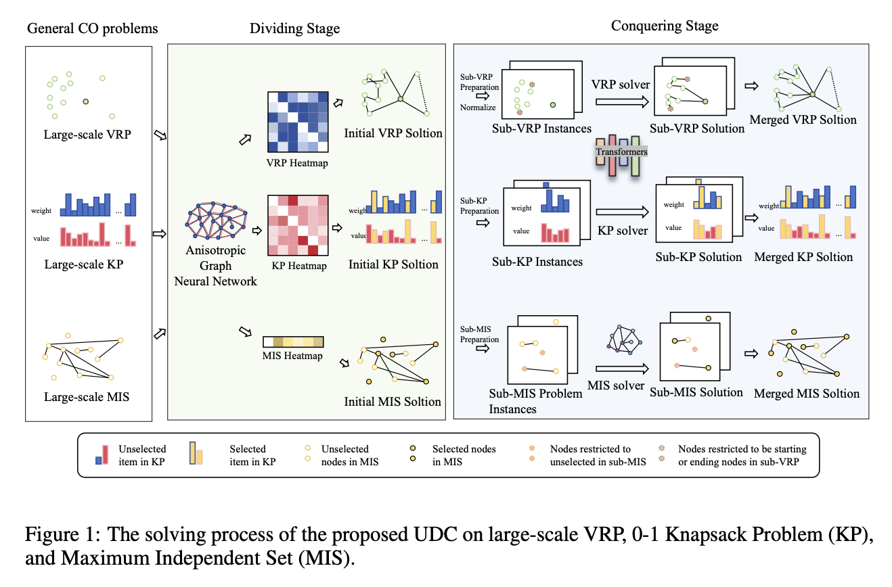
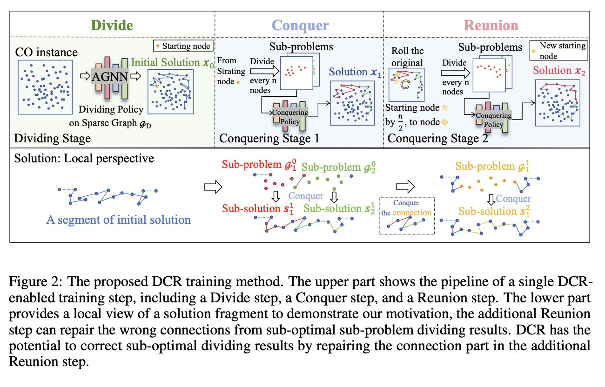
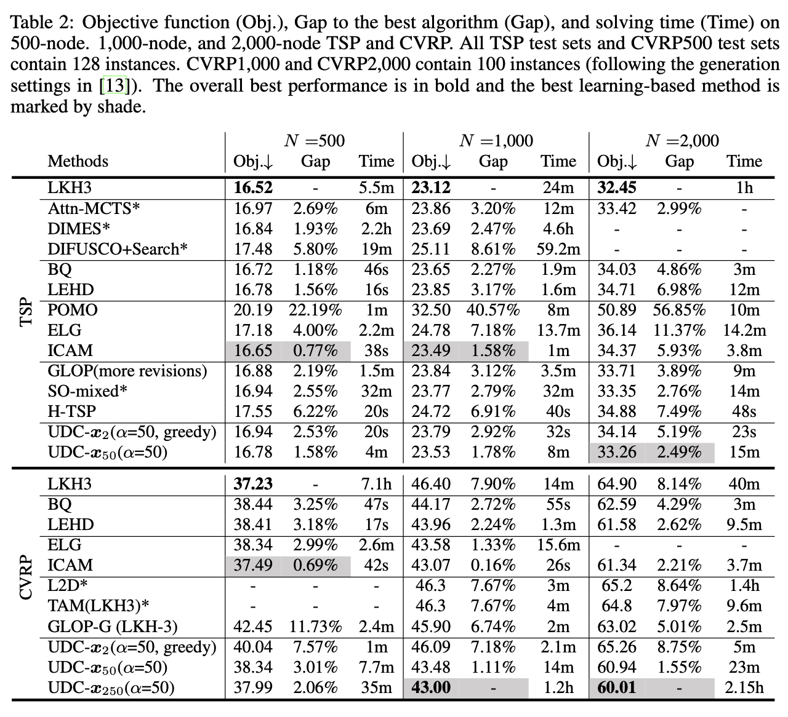
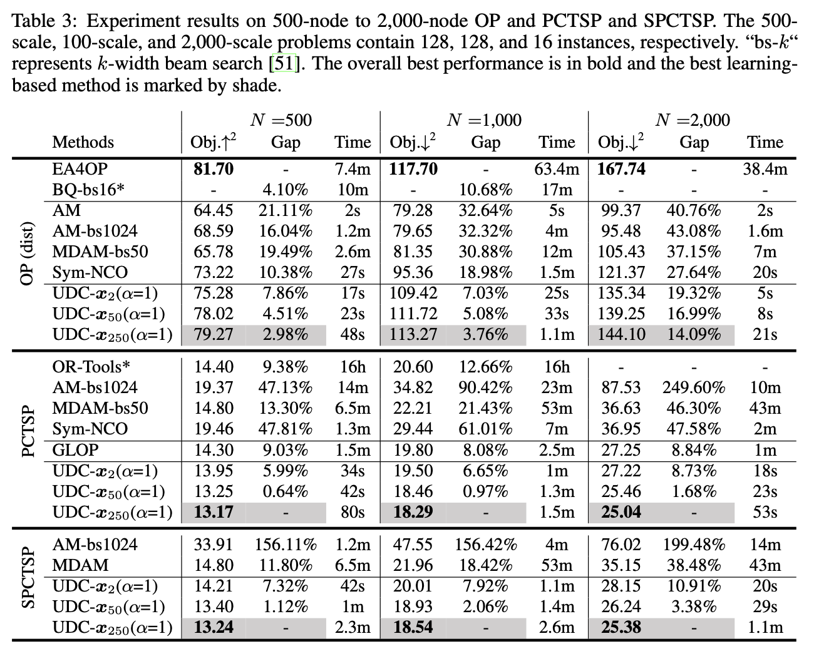
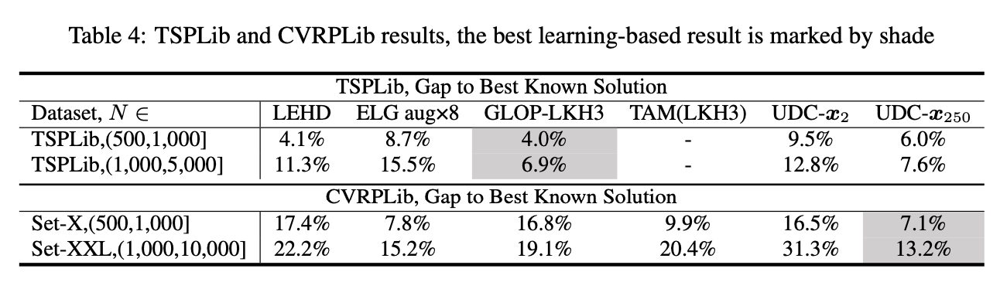
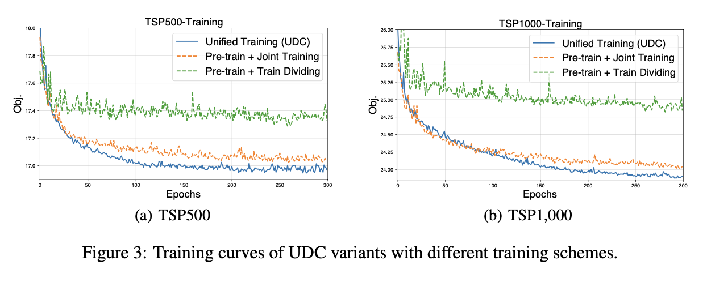

### Abstract

**Single-Stage Neural Combinatorial Optimization Solvers**
- Exhibit significant performance degradation when applied to large-scale combinatorial optimization (CO) problems.

**Two-Stage Neural Methods**
- Inspired by Divide-and-Conquer strategies.
- Efficient in addressing large-scale CO problems but rely heavily on problem-specific heuristics in either the dividing or conquering phase, limiting general applicability.
- Typically, employ separate training schemes, overlooking interdependencies between the two phases, often leading to convergence to suboptimal solutions.

Unified Neural Divide-and-Conquer Framework (UDC)
- Introduces the Divide-Conquer-Reunion (DCR) training method to address issues arising from suboptimal dividing policies.
- Utilizes a lightweight Graph Neural Network (GNN) to decompose large-scale CO instances.
- Employs a constructive solver to conquer the divided sub-problems effectively.
Demonstrates extensive applicability to diverse CO problems.
- Achieves superior performance across 10 representative large-scale CO problems.

---

### Introduction

**Combinatorial Optimization (CO) Applications**
- Route planning
- Circuit design
- Biology

**Reinforcement Learning (RL)-based Constructive Neural Combinatorial Optimization (NCO) Methods**

- Generate near-optimal solutions for small-scale instances (e.g., TSP instances with up to 200 nodes) without requiring expert knowledge.
- Construct solutions in an end-to-end manner, node-by-node.
- Limited capability when applied to large-scale instances.

**Categories of NCO Methods**

1. **Modified Single-Stage Solvers**
   - Methods like BQ-NCO and LEHD develop sub-path construction using heavy decoders.
   - Require supervised learning (SL), limiting applicability when high-quality labeled solutions are unavailable.

2. **Auxiliary Information for RL-Based Solvers**
   - Methods like ELG, ICAM, and DAR use auxiliary information to guide solvers.
   - Problem-specific auxiliary designs limit general applicability.
   - Complexity issues arise, particularly with self-attention mechanisms (e.g., $$O(N^2)$$ complexity).

3. **Neural Divide-and-Conquer Methods**
   - Inspired by traditional heuristic divide-and-conquer methods.
   - Use a two-stage approach: dividing the instance and conquering sub-problems.
   - Methods like TAM, H-TSP, and GLOP show improved efficiency in large-scale TSP and CVRP problems.

**Challenges in Large-Scale NCO**
- Heavy models requiring SL are limited by the availability of labeled solutions.
- Self-attention complexity $$O(N^2)$$ hinders scalability.
- Problem-specific auxiliary information limits general applicability.

### Shortcomings of Neural Divide-and-Conquer Approaches

**Limitations in Applicability and Solution Quality**
- Rely on problem-specific heuristics in either the dividing (e.g., GLOP, SO) or conquering (e.g., L2D, RBG) stages, which limits generalizability.

**Issues with Separate Training Process**
- Dividing and conquering policies are trained separately, which fails to consider their interdependencies, often resulting in convergence to local optima.

**Importance of Mitigating Sub-Optimal Dividing Impact**
- Addressing suboptimal dividing is crucial for achieving high-quality solutions.

### Proposed Approach

**Divide-Conquer-Reunion (DCR)**
- A novel RL-based training method designed to consider interdependencies between dividing and conquering stages.

**Unified Neural Divide-and-Conquer Framework (UDC)**
- Incorporates DCR in a unified training scheme.
- Uses a lightweight GNN to efficiently decompose large-scale instances into manageable sub-problems.
- Constructive solvers then effectively solve these sub-problems.

**Contributions**
- Propose DCR to mitigate the impact of suboptimal dividing policies.
- Achieve a unified training scheme in UDC, leading to improved performance.
- Demonstrate UDC's applicability across various CO problems.

---

### Preliminaries: Neural Divide-and-Conquer

**CO Problem Definition**
- Involves $N$ decision variables.
- Objective: Minimize function $$f(x, \mathcal{G})$$, where $G$ is the CO instance, and $$\Omega$$ is the set of feasible solutions.

$$\text{minimize}_{{x \in \Omega}} f(x, \mathcal{G})$$

**Divide-and-Conquer in CO**
- **Traditional Methods**
  - Use heuristic algorithms like large-neighborhood-search to divide and conquer.
  - Dividing stage selects sub-problems, and conquering stage repairs sub-problems.
- **Neural Divide-and-Conquer Methods**
  - Dividing policy $$\pi_d(\mathcal{G})$$ decomposes instance $G$ into sub-problems.
  - Conquering policy $$\pi_c$$ solves each sub-problem, and the total solution is obtained by concatenating sub-solutions.

### Constructive Neural Solver

**Overview**
- Efficient for small-scale CO problems.
- Uses an attention-based encoder-decoder network to construct solutions.

**Training Process**
- Modeled as a Markov Decision Process (MDP).
- Trained using Deep Reinforcement Learning (DRL) without expert experience.

**Solution Generation**
- Constructs solutions step-by-step using a trained policy $$\pi$$.

$$
\pi(x \mid \mathcal{G}, \Omega, \theta) = \prod_{t=1}^{\tau} p_{\theta}(x_t \mid x_{1:t-1}, \mathcal{G}, \Omega)
$$

### Heatmap-Based Neural Solver
**Overview**
- Uses lightweight GNNs for problem-solving, especially for large-scale CO problems like VRPs.

**Limitations**
- **Non-Autoregressive Generation**: Lacks partial solution order information, which can lead to poor solution quality.
- **Search Algorithm Dependence**: Relies on search algorithms for high-quality solutions.

$$
\pi(x \mid \mathcal{G}, \Omega, \theta) = p_{\theta}(\mathcal{H} \mid \mathcal{G}, \Omega) p(x_1) \prod_{t=2}^{\tau} \frac{\exp(\mathcal{H}_{x_{t-1}, x_t})}{\sum_{i=t}^{N} \exp(\mathcal{H}_{x_{t-1}, x_i})},
$$

---
### Methodology: Unified Divide-and-Conquer (UDC)

#### General Framework

- **Two Stages**: Dividing and Conquering.
- **Dividing Stage**: Generates initial solutions using an Anisotropic GNN (AGNN).
- **Conquering Stage**: Decomposes the original instance into sub-problems and solves them using constructive neural solvers.

**Solver Integration**
- Different solvers are used based on the type of CO problem.
- **AGNN** for Maximum Independent Set (MIS).
- **POMO** for Vehicle Routing Problem (VRP).
- **ICAM** for 0-1 Knapsack Problem (KP).

**Dividing Stage**

$$\pi_d(x_0|\mathcal{G}_D, \Omega, \phi) = \begin{cases}  p(\mathcal{H}|\mathcal{G}_D, \Omega, \phi) p(x_{0,1}) \prod_{t=2}^\tau \frac{\exp(\mathcal{H}_{x_0, t-1, x_0, t})}{\sum_{i=t}^N \exp(\mathcal{H}_{x_0, t-1, x_0, i})}, & \text{if } x_0 \in \Omega \\  0, & \text{otherwise}  \end{cases} $$

- original CO instance $$\mathcal{G}$$
- sparse graph $$\mathcal{G}_D = \{ \mathbb{V}, \mathbb{E} \}$$
- parameter $$\phi$ of Anisotropic Graph Neural Networks (AGNN)
- heatmap $$\mathcal{H}$$ (e.g For $$N$$-node VRPs, the heatmap $$\mathcal{H} \in \mathbb{R}^{N×N}$$ )
- initial solution $$x_0 = (x_{0,1},...,x_{0,\tau})$$, $$\tau$$ is length

**Conquering Stage: Sub-problem Preparation**

- sub-problems $$\{ \mathcal{G}_1,..., \mathcal{G}_{\lfloor \frac{N}{n} \rfloor} \}$$ 
- $$\{ \Omega_1,..., \Omega_{\lfloor \frac{N}{n} \rfloor} \}$$ constraints of sub-problems (e.g no self-loop in sub-TSPs)

**Conquering Stage: Constructive Neural Conquering**

$$\pi_c(s_k|\mathcal{G}_k, \Omega_k, \theta) = \begin{cases}
\prod_{t=1}^n p(s_{k,t} | s_{k,1:t-1}, \mathcal{G}_k, \Omega_k, \theta), & \text{if } s_k \in \Omega_k \\
0, & \text{otherwise}
\end{cases}
$$ 
- utilize constructive solvers with parameter $$\theta$ for most involved sub-CO problems.
- sub-solution $$s_{k} = (s_{k,1},...,s_{k,n})$$, $k \in \{ 1,..., \lfloor \frac{N}{n} \rfloor\}$$
- conquering policy $$\pi_c$$
- Replacement of original solution fragments in the final conquering stage: sub-solutions with improvements on the objective function replace the original solution fragment in $$x_0$$ 
- Formation of merged solution: the merged solution becomes $$x_1$$ 
- Repeated execution of conquering stage: conquering stage can be executed repeatedly on the new merged solution 
- Gradual improvement in solution quality: the solution after $$r$$ conquering stages is noted as $$x_r$$

### Training Method: Divide-Conquer-Reunion (DCR)

- Dividing and conquering stages modeled as MDPs.
- Separate training for conquering and dividing policies.
- Need for problem-specific datasets.
- Lack of collaboration in optimizing policies.
- Impact of sub-optimal sub-problem decomposition.
- Divide-Conquer-Reunion (DCR) process introduction.
- Additional Reunion step for better integration of sub-problems.
- Improved stability and convergence in training.
- Use of REINFORCE algorithm for unified training.
- Baseline calculation for both dividing and conquering policies.

$$\nabla \mathcal{L}d(\mathcal{G}) = \frac{1}{\alpha} \sum_{i=1}^\alpha $$
$$\left( f(x_2^i, \mathcal{G}) - \frac{1}{\alpha} \sum_{j=1}^\alpha f(x_2^j, \mathcal{G}) \right) \nabla \log \pi_d(x_2^i|\mathcal{G}_D, \Omega, \phi) $$
$$\nabla \mathcal{L}{c1}(\mathcal{G}) = \frac{1}{\alpha \beta \lfloor \frac{N}{n} \rfloor} \sum_{c=1}^{\alpha \lfloor \frac{N}n \rfloor} \sum_{i=1}^\beta \left( \left( f{\prime}(s_{c}^{1,i}, \mathcal{G}_{c}^0) - \frac{1}{\beta} \sum_{j=1}^\beta f{\prime}(s_{c}^{1,j}, \mathcal{G}_{c}^0) \right) \nabla \log \pi_c(s_{c}^{1,j}|\mathcal{G}_{c}^0, \Omega_{c}, \theta) \right)$$
$$\nabla \mathcal{L}{c2}(\mathcal{G}) = \frac{1}{\alpha \beta \lfloor \frac{N}{n} \rfloor} \sum_{c=1}^{\alpha \lfloor \frac{N}n \rfloor} \sum_{i=1}^\beta \left( \left( f{\prime}(s_{c}^{2,i}, \mathcal{G}_{c}^1) - \frac{1}{\beta} \sum_{j=1}^\beta f{\prime}(s_{c}^{2,j}, \mathcal{G}_{c}^1) \right) \nabla \log \pi_c(s_{c}^{2,j}|\mathcal{G}_{c}^1, \Omega_{c}, \theta) \right)$$

- $$\{ x_2^1, ..., x_{2}^{\alpha} \}$$ represents the $$\alpha$$ sampled solutions.
- there are $$\alpha \lfloor \frac{N}{n} \rfloor$ sub-problems $$\mathcal{G}^{0}_{c},c \in \{ 1, ..., \lfloor \frac{N}{n} \rfloor, ..., \alpha \lfloor \frac{N}{n} \rfloor\}$$ generated based on $$\{ x_0^1, ..., x_{0}^{\alpha} \}$$ in the first conquering stage
- $$\alpha \lfloor \frac{N}{n} \rfloor$$ can be regarded as the batch size of sub-problems
- The $$\beta$$ sampled sub-solutions for sub-problem $$\mathcal{G}_{c}^{0}, \mathcal{G}_{c}^{1},c \in \{1,..., \alpha \lfloor \frac{N}{n} \rfloor\}$$ are noted as $$\{s_{c}^{1,i},...,s_{c}^{1,\beta}\},\{s_{c}^{2,i},...,s_{c}^{2,i}\}$$.

**Challenges and Proposed Solution**
- Existing methods fail to train dividing and conquering policies simultaneously, leading to unsolvable antagonisms.
- **Unified Training Requirement**: DCR enables collaborative optimization of dividing and conquering policies by treating connections between sub-problems as new problems to reconquer.

**Training Process with REINFORCE**
- Uses the REINFORCE algorithm to train both dividing and conquering policies, ensuring better reward estimation and improved convergence.

### Application: General CO Problems

**Conditions for Applicability**
1. **Decomposable Objective Functions**: The objective function must contain decomposable aggregate functions (i.e., no functions like Rank or Top-k).
2. **Feasibility of Initial and Sub-Solutions**: Ensured using feasibility masks.
3. **Non-Uniqueness of Sub-Problem Solutions**: Solutions for sub-problems should not be unique to ensure flexibility in merging sub-solutions.

**Limitations**
- Complex CO problems may face issues where solutions cannot be guaranteed as legal through the process, limiting applicability.
- Problems such as TSPTW may have constraints that make ensuring legal initial and sub-solutions difficult.

---
### Experiment

**Overview**
- To verify the applicability and efficiency of UDC, experiments were conducted across 10 different CO problems, including TSP, CVRP, KP, MIS, and more.
- UDC was compared to both classical and neural solvers.

**Performance Evaluation**
- UDC demonstrated superior performance in terms of solution quality and computational efficiency across large-scale CO instances, ranging from 500-node to 2,000-node problems.

**Comparison to Baselines**
- Classical solvers like LKH and other neural methods (e.g., ELG, GLOP) were used as baselines.
- UDC consistently outperformed other methods, particularly in large-scale settings where scalability is critical.

--- 
### Conclusion

**Summary**
- UDC, with its novel DCR training mechanism, successfully addresses the limitations of existing neural divide-and-conquer methods for large-scale CO problems.
- The unified training scheme ensures that both dividing and conquering stages work in synergy, thereby achieving better overall optimization.

**Future Work**
- Further improvements can be made by designing better loss functions for training.
- Extending UDC's applicability to other complex CO problems not covered in the current study is another promising direction for future research.
